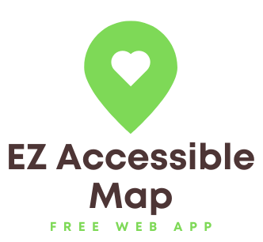

[Check out the free online demo](https://ezpassaccessiblemap.netlify.app/)

[](https://app.netlify.com/start/deploy?repository=https://github.com/kevinl95/ez-accessible-map)

# Interactive Map of MTA E-ZPass Retailers by Accessibility

This project is an interactive map showcasing MTA E-ZPass retailers based on their how accessible they are for the mobility impaired. It was developed for the **2024 MTA Open Data Challenge**, which invites community members, developers, and data enthusiasts to creatively utilize MTA's open datasets.

## Project Overview

This project uses the [MTA E-ZPass Retailers Locations](https://data.ny.gov/Transportation/MTA-E-ZPass-Retailers-Locations/y59h-w6v4) dataset and information from the Google Places API to create an interactive map of retailers based on their accessibility. Using Python and libraries like Folium and Pandas the data is read, a new dataset is produced by combining it with the information we retrieve by looking up businesses with the Google Places API and extracting accessibility information, and then an interactive map is generated that you can view on the web. This map is color coded:

- Red means the location is not accessible for wheelchair users
- Orange means the accessibility of this location is currently unknown
- Green means the location is wheelchair accessible

The project can be deployed with a single click to [Netlify](https://www.netlify.com/), a cloud host for web apps with a generous free tier.

### Features

- **Interactive Map**: Users can interact with the map to view locations of E-ZPass retailers color-coded with their known wheelchair accessibility
- **Accessibility Information**: Each retailer marker provides accessibility information pulled from the Google Places API.
- **Dynamic Updates**: The map is populated with data fetched from a CSV file containing MTA retailer information as well as from the Places API.

## Deployment Instructions

If you have a free Netlify account, you can click the `Deploy to Netlify' button at the top of this page. Add your Google Places API key ([Learn how to get one here!](https://developers.google.com/maps/documentation/places/web-service/overview)) to your environment variables and view your deployed map after a few minutes.

To deploy this project locally, follow these steps:

### Prerequisites

- Python 3.12 or newer installed on your machine
- An active Google Places API key ([Learn how to get one here!](https://developers.google.com/maps/documentation/places/web-service/overview))

### Setup

1. **Clone the repository** (or download the files):

   ```bash
   git clone <repository-url>
   cd <repository-directory>
   ```

2. **Install required Python packages**:

   ```bash
   python -m pip install pipenv
   pipenv install
   pipenv shell
   ```

3. **Set your Google Places API key**:

To keep your API key secure, set it as an environment variable. In your terminal, run:

   ```bash
   export GOOGLE_PLACES_API_KEY='YOUR_GOOGLE_PLACES_API_KEY'  # On Windows use `set GOOGLE_PLACES_API_KEY=YOUR_GOOGLE_PLACES_API_KEY`
   ```

4. **Run the build script**:
Execute the Python script to generate the interactive map:

   ```bash
   python main.py
   ```

In the output folder that is created will be a new file called index.html. You can click this file to open it in your default web browser and view your new interactive map!
